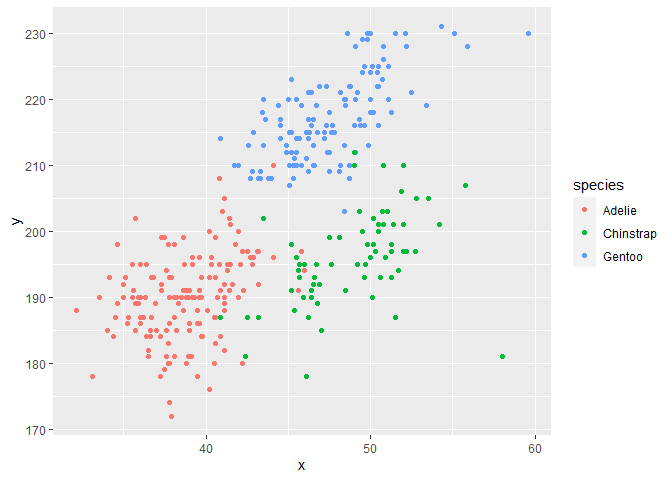

Homework 1
================
Yiyao LI

This is my solution to HW1.

``` r
library(tidyverse)
```

    ## -- Attaching packages ---------- tidyverse 1.3.0 --

    ## √ ggplot2 3.3.2     √ purrr   0.3.4
    ## √ tibble  3.0.3     √ dplyr   1.0.2
    ## √ tidyr   1.1.2     √ stringr 1.4.0
    ## √ readr   1.3.1     √ forcats 0.5.0

    ## -- Conflicts ------------- tidyverse_conflicts() --
    ## x dplyr::filter() masks stats::filter()
    ## x dplyr::lag()    masks stats::lag()

## Problem 1

Create a data frame with the specified elements.

``` r
prob1_df = 
  tibble(
    samp = rnorm(10),
    samp_gt_0 = samp > 0,
    char_vec = c("a", "b", "c", "d", "e", "f", "g", "h", "i", "j"),
    factor_vec = factor(c("low", "low", "low", "mod", "mod", "mod", "mod", "high", "high", "high"))
)
```

Take the mean of each variable in my data frame.

``` r
mean(pull(prob1_df, samp))
```

    ## [1] 1.077041

``` r
mean(pull(prob1_df, samp_gt_0))
```

    ## [1] 0.9

``` r
mean(pull(prob1_df, char_vec,))
```

    ## Warning in mean.default(pull(prob1_df, char_vec, )): argument is not numeric or
    ## logical: returning NA

    ## [1] NA

``` r
mean(pull(prob1_df, factor_vec))
```

    ## Warning in mean.default(pull(prob1_df, factor_vec)): argument is not numeric or
    ## logical: returning NA

    ## [1] NA

I can take mean of numbers and logical but not character or factor.

``` r
as.numeric(pull(prob1_df, samp))
```

    ##  [1]  0.9634663  2.1723120  0.2817987  2.3325112  0.2813312  0.8870858
    ##  [7] -0.5193115  0.8282577  2.7682250  0.7747319

``` r
as.numeric(pull(prob1_df, samp_gt_0))
```

    ##  [1] 1 1 1 1 1 1 0 1 1 1

``` r
as.numeric(pull(prob1_df, char_vec))
```

    ## Warning: 强制改变过程中产生了NA

    ##  [1] NA NA NA NA NA NA NA NA NA NA

``` r
as.numeric(pull(prob1_df, factor_vec))
```

    ##  [1] 2 2 2 3 3 3 3 1 1 1

``` r
as.numeric(pull(prob1_df, samp_gt_0)) * pull(prob1_df, samp)
```

    ##  [1] 0.9634663 2.1723120 0.2817987 2.3325112 0.2813312 0.8870858 0.0000000
    ##  [8] 0.8282577 2.7682250 0.7747319

``` r
as.factor(pull(prob1_df, samp_gt_0)) * pull(prob1_df, samp)
```

    ## Warning in Ops.factor(as.factor(pull(prob1_df, samp_gt_0)), pull(prob1_df, : '*'
    ## not meaningful for factors

    ##  [1] NA NA NA NA NA NA NA NA NA NA

``` r
as.numeric(as.factor(pull(prob1_df, samp_gt_0))) * pull(prob1_df, samp)
```

    ##  [1]  1.9269326  4.3446240  0.5635974  4.6650224  0.5626623  1.7741716
    ##  [7] -0.5193115  1.6565154  5.5364500  1.5494637

## Problem 2

Write a short description of the penguins dataset

``` r
data("penguins", package = "palmerpenguins")
```

the data in this dataset, including names / values of important
variables

``` r
names(penguins)
```

    ## [1] "species"           "island"            "bill_length_mm"   
    ## [4] "bill_depth_mm"     "flipper_length_mm" "body_mass_g"      
    ## [7] "sex"               "year"

``` r
levels(pull(penguins,species))
```

    ## [1] "Adelie"    "Chinstrap" "Gentoo"

``` r
levels(pull(penguins,island))
```

    ## [1] "Biscoe"    "Dream"     "Torgersen"

``` r
range(pull(penguins,bill_length_mm), na.rm = TRUE)
```

    ## [1] 32.1 59.6

``` r
range(pull(penguins,bill_depth_mm), na.rm = TRUE)
```

    ## [1] 13.1 21.5

``` r
range(pull(penguins,flipper_length_mm), na.rm = TRUE)
```

    ## [1] 172 231

``` r
range(pull(penguins,body_mass_g), na.rm = TRUE)
```

    ## [1] 2700 6300

``` r
levels(pull(penguins,sex))
```

    ## [1] "female" "male"

``` r
range(pull(penguins,year))
```

    ## [1] 2007 2009

the size of the dataset

``` r
nrow(penguins)
```

    ## [1] 344

``` r
ncol(penguins)
```

    ## [1] 8

the mean flipper length

``` r
mean(range(pull(penguins,flipper_length_mm), na.rm = TRUE))
```

    ## [1] 201.5

Scatter plot of flipper\_length\_mm (y) vs bill\_length\_mm(x)

``` r
plot_df = tibble(
  x = pull(penguins,bill_length_mm),
  y = pull(penguins,flipper_length_mm),
  species = pull(penguins,species)
)

ggplot(plot_df, aes(x = x, y = y, color = species)) + geom_point()
```

    ## Warning: Removed 2 rows containing missing values (geom_point).

<!-- -->

``` r
ggsave("scatterplot.pdf", width = 4, height = 4)
```

    ## Warning: Removed 2 rows containing missing values (geom_point).
